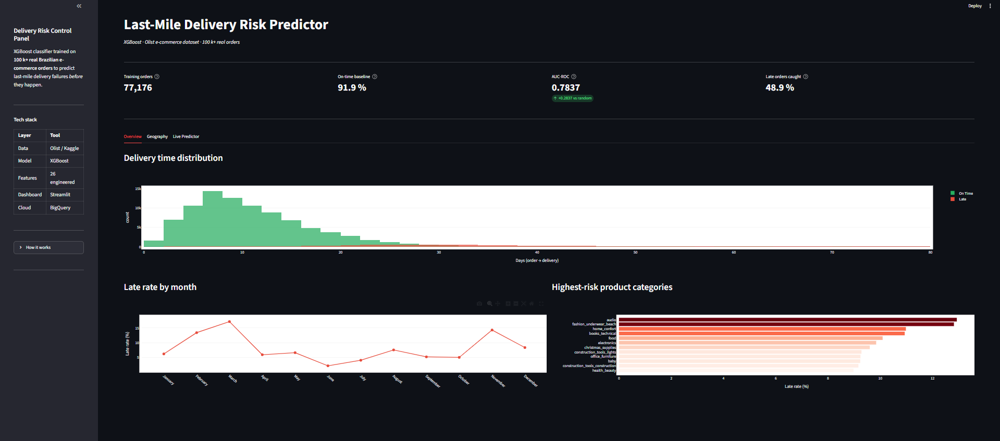
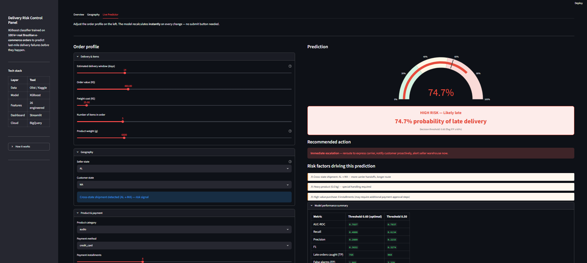
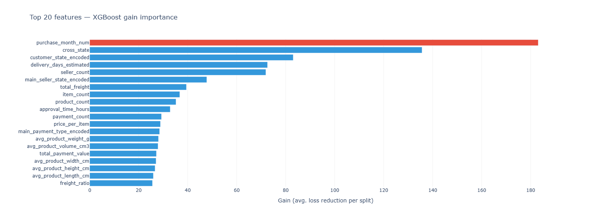
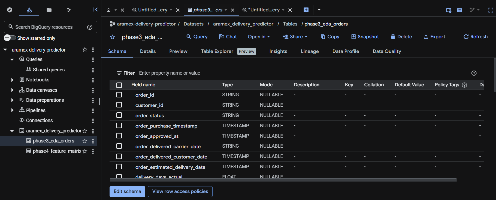

# Last-Mile Delivery Success Prediction

An end-to-end machine learning project that predicts whether an e-commerce delivery is at risk of arriving late. The project uses real public order data, feature engineering, XGBoost classification, a Streamlit dashboard, SQL analytics, and an optional BigQuery cloud data warehouse layer.

## Project Goal

The goal is to help logistics teams identify high-risk deliveries before they fail, allowing proactive intervention such as route monitoring, warehouse follow-up, or customer notification.

Instead of only reporting late deliveries after they happen, this project demonstrates how machine learning can support early operational decision-making.

## Business Context

Last-mile delivery is one of the most expensive and customer-sensitive parts of logistics. A late delivery can lead to customer dissatisfaction, additional support workload, and reduced trust.

This project simulates a logistics risk-scoring system where each order receives a late-delivery probability. Orders above the decision threshold can be flagged for operational review.

## Dataset

The project uses the Brazilian E-Commerce Public Dataset by Olist from Kaggle.

The dataset includes order, customer, seller, product, payment, review, and delivery timestamp information. It contains over 100,000 real e-commerce orders.

Raw data is not included in this repository. Users should download the dataset from Kaggle and place the CSV files inside:

```text
data/raw/
```

## Tech Stack

| Layer            | Tools                 |
| ---------------- | --------------------- |
| Data processing  | Python, Pandas, NumPy |
| Machine learning | XGBoost, Scikit-learn |
| Visualization    | Plotly, Streamlit     |
| SQL analytics    | BigQuery, SQL         |
| Cloud layer      | Google Cloud BigQuery |
| Version control  | Git, GitHub           |

## Project Pipeline

```text
Phase 1: Project setup
Phase 2: Data loading and schema understanding
Phase 3: Exploratory data analysis
Phase 4: Feature engineering
Phase 5: XGBoost model training
Phase 6: Streamlit dashboard
Phase 7: BigQuery and SQL analytics
Phase 8: GitHub portfolio packaging
```

## Key Model Results

The final XGBoost model achieved:

| Metric             |  Value |
| ------------------ | -----: |
| AUC-ROC            | 0.7837 |
| Recall             | 0.4888 |
| Precision          | 0.2889 |
| F1-score           | 0.3632 |
| Decision threshold |   0.60 |

The natural late-delivery rate in the dataset was approximately 8.11%. At the selected threshold, the model’s flagged orders had a much higher concentration of late deliveries than random order selection.

## Business Interpretation

The model identified almost half of late deliveries in the held-out test set. Although the model is not perfect, it meaningfully concentrates late-risk orders into a smaller group that operations teams can monitor.

This supports a practical logistics workflow:

```text
Incoming order
    ↓
Feature engineering
    ↓
XGBoost late-risk probability
    ↓
Risk threshold decision
    ↓
Operations review / monitoring / customer notification
```

## Important Features

The most important model drivers included:

* Purchase month
* Cross-state shipment
* Customer state
* Estimated delivery window
* Seller count
* Seller geography
* Freight and order characteristics

These features suggest that delivery risk is influenced by timing, geography, route complexity, and shipment characteristics.

## Dashboard

The Streamlit dashboard allows users to enter an order profile and receive a live late-risk prediction.

Example dashboard screenshots:







## BigQuery SQL Analytics

The processed datasets were uploaded into BigQuery as an optional cloud analytics layer.

The SQL workflow calculates:

* Overall late-delivery KPIs
* State-level late-delivery rates
* Seller-state risk ranking
* Monthly delivery trends
* Cross-state versus same-state delivery risk
* Worst seller-state to customer-state route pairs

Example BigQuery screenshot:



## Repository Structure

```text
aramex-delivery-predictor/
│
├── dashboard/
│   └── app.py
│
├── notebooks/
│   ├── 02_data_preview.py
│   ├── 03_eda.py
│   ├── 04_feature_engineering.py
│   ├── 05_model.py
│   └── 07_bigquery_sql.py
│
├── src/
│   ├── data_loader.py
│   ├── features.py
│   └── model.py
│
├── reports/
│   └── screenshots/
│
├── .env.example
├── .gitignore
├── README.md
└── requirements.txt
```

## How to Run

### 1. Clone the repository

```bash
git clone https://github.com/muneeraaaa/last-mile-delivery-predictor.git
cd last-mile-delivery-predictor
```

### 2. Create and activate a virtual environment

```bash
python -m venv venv
venv\Scripts\activate
```

### 3. Install requirements

```bash
pip install -r requirements.txt
```

### 4. Add the dataset

Download the Olist Brazilian e-commerce dataset from Kaggle and place the CSV files inside:

```text
data/raw/
```

### 5. Run the pipeline

```bash
python notebooks/02_data_preview.py
python notebooks/03_eda.py
python notebooks/04_feature_engineering.py
python notebooks/05_model.py
```

### 6. Run the dashboard

```bash
streamlit run dashboard/app.py
```

### 7. Optional: BigQuery SQL layer

Create a `.env` file in the project root:

```env
GOOGLE_CLOUD_PROJECT=your-google-cloud-project-id
```

Authenticate with Google Cloud:

```bash
gcloud auth application-default login
```

Then run:

```bash
python notebooks/07_bigquery_sql.py
```

## Security Notes

This repository intentionally excludes:

* raw datasets
* processed datasets
* trained model binaries
* `.env` files
* Google Cloud credentials
* Kaggle API keys
* virtual environment folders

These files are excluded through `.gitignore`.

## Future Improvements

* Add live BigQuery connection to dashboard KPIs
* Deploy the Streamlit dashboard
* Add SHAP explainability for individual predictions
* Improve threshold selection based on operational cost assumptions
* Add model monitoring for drift
* Test alternative models such as LightGBM and CatBoost

## Disclaimer

This project uses a public Brazilian e-commerce dataset as a proxy for last-mile logistics risk prediction. It is not trained on private company operational data.
